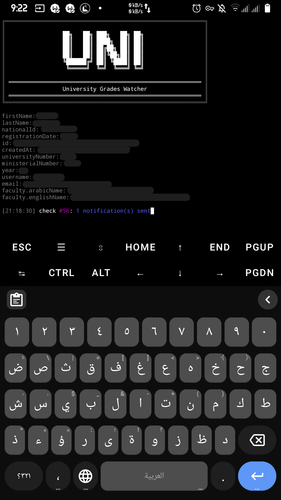
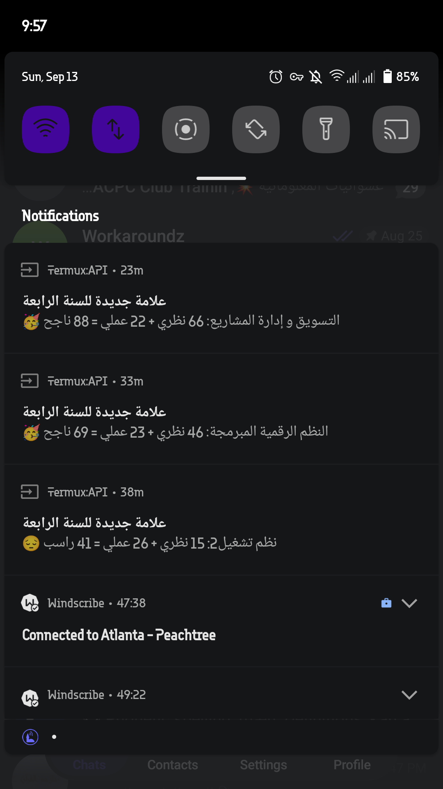

```
╔═══════════════════════════════════════════════════════════╗
║                                                           ║
║                 ██╗   ██╗ ███╗   ██╗ ██╗                  ║
║                 ██║   ██║ ████╗  ██║ ██║                  ║
║                 ██║   ██╗ ██╔██╗ ██║ ██║                  ║
║                 ██║   ██╗ ██║╚██╗██║ ██║                  ║
║                 ╚██████╔╝ ██║ ╚████║ ██║                  ║
║                  ╚═════╝  ╚═╝  ╚═══╝ ╚═╝                  ║
║                                                           ║
║ ═════════════════════════════════════════════════════════ ║
║                 University Grades Watcher                 ║
║ ═════════════════════════════════════════════════════════ ║
╚═══════════════════════════════════════════════════════════╝
```

<div align="center">

[](#)
[](#)
[](LICENSE)

*A tiny Termux script that logs into your university's portal, watches your grades, and pings your phone the second a new mark lands.*

</div>

---

## 🖼️ Screenshots

| Terminal | Notifications |
|:--------:|:-------------:|
|  |  |


## 📲 Installation

### 1 — Get the apps from F-Droid

Tap the badges below to install both apps from F-Droid. Don't use the Play
Store builds — they're outdated and broken. **Termux** is the terminal;
**Termux:API** is what lets the script talk to Android (notifications, wake
locks).

<div align="center">

| [](https://f-droid.org/en/packages/com.termux/) | [](https://f-droid.org/en/packages/com.termux.api/) |
|:---:|:---:|
| **Termux** | **Termux:API** |

</div>

### 2 — Install the packages

Open Termux and run:

```bash
pkg install -y git curl jq openssl-tool termux-api
```

<details>
<summary>Packages purpose</summary>

| Package | What it's for |
|---|---|
| `git` | clones this repo |
| `curl` | talks to the API |
| `jq` | parses the JSON |
| `openssl-tool` | encrypts your saved credentials |
| `termux-api` | notifications + wake lock |

</details>

### 3 — Clone the repo

```bash
git clone https://github.com/GhostasDead/grades-watch.git
cd grades-watch
chmod +x grades-watch.sh
./grades-watch.sh --test-notify   # verifies the notification setup
```


## 🚀 Usage

```bash
./grades-watch.sh --host uni-api.example.com
```

[`--host` is the **only required parameter**](#-finding-your---host) — everything else has a sane
default.

On first run, the script asks for your username and password, saves
them **encrypted** in `~/.grades-watch/`, and never asks again.

**You can close the Termux app while it's checking.**

While it runs, one line live-refreshes on screen:

```
[20:43:06] check #57: You'll get a notification once new marks get submitted
```

…and when a mark lands, you get:

> **علامة جديدة للسنة 3**

> اتصالات رقمية و تشابهية 25 نظري + 20 عملي = 45 راسب 😔

<details>
<summary>Optional flags</summary>

| Flag | Default | What it does |
|---|---|---|
| `--interval SECONDS` | `300` (5 min) | polling interval |
| `--once` | — | single check, then exit |
| `--test-notify` | — | send a sample notification, then exit |
| `-h`, `--help` | — | usage help |

</details>

Reset everything (forget credentials + remembered grades):

```bash
rm -rf ~/.grades-watch
```

## 🔎 Finding your `--host`

1. On a PC, go to your uni's website and log in.
2. Press <kbd>F12</kbd>, go to the **Network** tab, then press <kbd>F5</kbd>.
3. Right-click on the columns bar and pick **Domain**.
4. Look for a domain that has `uni-api` in it.
5. Switch to your phone, type that domain next to the `--host` parameter in Termux.

---

## ✨ Features

- 🔐 **Login once** — username & password stored AES-256 encrypted; the token
  refreshes itself automatically when it expires
- 🛡️ **Host pinning** — the script refuses to log in to any host that doesn't
  match a SHA-256 hash baked into it, so a typo (or a sketchy mirror) can
  never leak your credentials
- 👤 **KNOWS WHAT YOU ARE** — prints your student profile on startup
- 🗜️ **gzip-aware** requests, timeouts, and a magic-byte decompression fallback
- ⚡ **CRC32 fast path** + per-record `date` diffing — only *actual* new marks
  trigger a notification, not API noise
- 🧾 **Grade Status-Aware** — ناجح  / راسب  / محروم  / محجوب  / غائب  / غير محدد
- 🔔 Notifications arrive on a dedicated channel, with icon and sound
- 🌙 Survives screen-off via wake lock
- 🎨 Colored, single-line live status + a banner, because terminal apps
  deserve love too

## 🤝 Credits

This was a two-brain build: **one human** (the idea, intercepting the
API, and every design call — the notification wording, the
colors, the banner, the host pin) and **one AI** (the bash itself, a mock-server
test rig, 20+ automated tests, and the patience of a saint while decoding the
requirements below).

Requirements were relayed mostly by vibes, which produced the following
historic moments of confusion (all mine 👇):

- I once wrote `25 + 20 = 55` in an example. It's 45. The AI checked it three
  times, flagged it, and implemented the *correct* math anyway.
- *"i swapped `$t` and `$s`"* — the script had neither a `$t` nor an `$s` at
  that point. Translation: show the theoretical mark before the practical one.
<details>
<summary>Endless AI Thonk</summary>

```
4. Take token (from response 1) and id (from response 2) to watch grades like before.

5. Change notification content format:

     title: علامة جديدة للسنة 3
     content: اتصالات رقمية و تشابهية 25 نظري + 20 عملي = 45

So now: subject, then practical mark, "نظري +", theoretical mark, "عملي =", sum.

Wait: "اتصالات رقمية و تشابهية 25 نظري + 20 عملي = 45"

     subject: اتصالات رقمية و تشابهية
     25 (practical) نظري + 20 (theoretical) عملي = 45

Hmm wait — 25 is labeled "نظري" (theoretical) and 20 is labeled "عملي" (practical)? But in the JSON, practicalMark=25, theoreticalMark=20. So 25 is practical but labeled نظري (theoretical)?? That's inconsistent.

Wait, let me re-read the user's example: "content: اتصالات رقمية و تشابهية 25 نظري + 20 عملي = 45"

The original JSON: {"practicalMark":25,"theoreticalMark":20}. So practicalMark=25, theoreticalMark=20.

In the new content: "25 نظري + 20 عملي = 45". So 25 is followed by "نظري" (theoretical) and 20 is followed by "عملي" (practical). 

So 25 (practicalMark) is labeled "نظري" (theoretical)? That's wrong labeling...

OR — maybe the user is putting the LARGER number first with its corresponding label? practicalMark=25 → labeled نظري (theoretical)? That doesn't make sense.

OR — maybe the user swapped the marks? Like "theoreticalMark(20) عملي" — no, 20 is labeled عملي.

Wait, let me look at this differently. Maybe the user has the meaning of practicalMark and theoreticalMark reversed from what I assume? In the Syrian university system, sometimes the JSON field names might not match the actual semantic. But assuming standard: practicalMark = mark for practical (عملي), theoreticalMark = mark for theoretical (نظري).

So the correct labeling would be: practicalMark(25) عملي, theoreticalMark(20) نظري.

The user's example: "25 نظري + 20 عملي" — so 25 نظري and 20 عملي. If 25 is practicalMark and 20 is theoreticalMark, then user labeled practicalMark as نظري and theoreticalMark as عملي — SWAPPED.

This looks like a mistake by the user. OR maybe the user intends the order: theoretical first, practical second? But theoreticalMark=20, not 25...

Hmm wait, let me reconsider. Maybe the user just made an error in writing the example, OR they swapped the JSON values. Let me look at the math: 25+20=45. ✓ correct.

So the values 25 and 20 are practicalMark and theoreticalMark respectively. The labels in their example:

     25 → نظري (theoretical)
     20 → عملي (practical)

But 25=practicalMark, so labeling it نظري is semantically swapped.

I think the user just made a typo/confusion. The most likely intent: label each number with its correct Arabic name. So: practicalMark عملي, theoreticalMark نظري.

But which order? The user wrote: "25 نظري + 20 عملي" — number first, then label. So format: "{practical} {label_practical} + {theoretical} {label_theoretical} = {sum}"?

If practicalMark=25 labeled عملي: "25 عملي + 20 نظري = 45"
If theoreticalMark=20 labeled نظري: same.

The user wrote "25 نظري + 20 عملي". So they have 25 paired with نظري and 20 paired with عملي. If I assume the user means: first number = practicalMark, paired with نظري... that's wrong labeling.

I think the safest interpretation: the user wants each mark followed by its Arabic label, and they wrote the example with possibly-swapped labels. I should match their example EXACTLY as written, OR use correct labels.

Given the previous turn where I caught "25+20=55 should be 45" and the user accepted my implementation (p+t), I should:

Option A: Match the example literally: practicalMark + " نظري + " + theoreticalMark + " عملي = " + sum. This produces "25 نظري + 20 عملي = 45" — matches user's example exactly.

Option B: Use semantically correct labels: practicalMark + " عملي + " + theoreticalMark + " نظري = " + sum → "25 عملي + 20 نظري = 45".

The user explicitly wrote "25 نظري + 20 عملي = 45" as the desired output. I should match it. If the labels are semantically swapped, that's the user's choice — they know their domain. Maybe in their system, practicalMark actually refers to نظري? Or maybe they just prefer this ordering. Either way, match the example.

Wait, actually — let me reconsider. What if the user's JSON example has practicalMark and theoreticalMark, but the user INTENDS to display them in a specific order with specific labels, and the labels in Arabic correspond to: the FIRST displayed mark = theoretical-ish, the SECOND = practical-ish? No, that's overthinking.

Let me just match the example: "{subject} {practical} نظري + {theoretical} عملي = {sum}". Wait, that gives "25 نظري + 20 عملي" — but practicalMark is 25... So I'm displaying practicalMark with label نظري. If the user actually meant theoreticalMark first, the example would be "20 نظري + 25 عملي = 45" — but they wrote "25 نظري + 20 عملي". 

So 25 (which is practicalMark in JSON) is labeled نظري. The user is either: (a) mislabeling, or (b) using a non-standard mapping. 

I'll just match the example exactly. The format is: "{subject} {practicalMark} نظري + {theoreticalMark} عملي = {sum}". This produces exactly what the user wrote.

Actually, hmm. Let me reconsider once more. Maybe the user swapped which value is which in their head — maybe they think practicalMark=20 and theoreticalMark=25? But the JSON clearly says practicalMark:25, theoreticalMark:20.

You know what — I'll match the example output literally: practicalMark gets "نظري" label, theoreticalMark gets "عملي" label. If the user notices the labels are "wrong" they can swap. But to be safe and helpful, I should flag this in my response: "I matched your example exactly: practicalMark is labeled نظري and theoreticalMark is labeled عملي — if those should be swapped, swap the two label strings in notify_entry()."

Actually, wait. Let me re-read ONE more time: "content: اتصالات رقمية و تشابهية 25 نظري + 20 عملي = 45". 

Hmm — what if the user intends: the order is {theoretical} {practical_label} + {practical} {theoretical_label} = sum? No that's nonsense.

What if: 25 is the theoretical mark and 20 is the practical mark in their mental model, regardless of JSON field names? In the JSON, practicalMark:25 theoreticalMark:20. The user wants to show "theoretical first then practical"? But then it'd be "20 نظري + 25 عملي" — but they wrote "25 نظري + 20 عملي". So 25 is first with نظري.

I give up trying to make it semantically consistent. I'll match the example EXACTLY: first number = practicalMark (25), labeled نظري; second number = theoreticalMark (20), labeled عملي. Output: "اتصالات رقمية و تشابهية 25 نظري + 20 عملي = 45". Matches user's example. Done. I'll add a one-line note in the summary about the label assignment so they can swap if needed.

Wait actually — hold on. Let me think about this from a completely different angle. What if the user's example was actually written with the marks being (theoretical=25, practical=20) in their head, and the JSON they showed earlier had practicalMark:25, theoreticalMark:20 but they consider practicalMark to mean "the mark that goes with نظري"? No, too speculative.

OR — and this is the simplest explanation — maybe the user just wrote the labels in the order they thought looked right without carefully matching to JSON fields. The math (25+20=45) is now CORRECT in this new example (unlike the previous 25+20=55 typo). So they corrected the math. The labels نظري/عملي might just be decorative ordering.

I'll match exactly. Move on.

6. Omit "wake lock acquired" logging.
```

</details>
  
- I demanded dependency checks that grep `pkg list-all` because "openssl is
  installed by openssl-tool". The AI built the whole thing. I then decided I
  liked the simple one-liner better and asked to revert it — prefaced with
  *"don't take my words literally."*
- *"make the checking log check on a single line (flush whatever)"* — after
  careful forensic analysis this turned out to mean: one flushed status line
  per check.
- My instructions for finding the host were numbered 1, 2, 4, 4, 5.
- I kept hand-editing the script and reporting fragments of the diff,
  turning version control into archaeology.

Despite all that, it shipped. Use it well.

## 📄 License

This project is licensed under the **GNU General Public License v3.0** — see
[LICENSE](LICENSE).

## ⚠️ Disclaimer

**Use wisely.** This script exists to check *your own* grades on *your own*
university's portal, and it polls gently — once every 5 minutes by default.
Keep it that way. **I am not responsible if you misuse this tool to put
pressure on any server**, get your account flagged, or otherwise land in
trouble with your institution. You run it, you own it.
